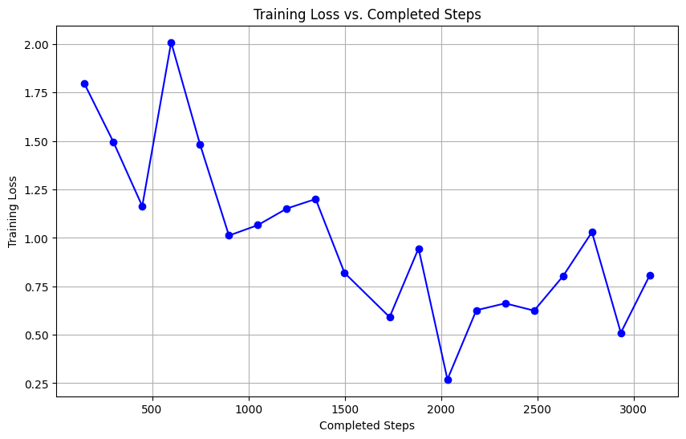

In this [experiment](Question-Answering.ipynb), I fine-tuned a BERT model on the SQuAD dataset for the task of extractive question answering. (I learned the general data preprocessing, training and evaluation approach from this [tutorial](https://huggingface.co/learn/nlp-course/chapter7/7?fw=pt) on Hugging Face NLP course, and wrote my own scripts.)

The goal is to identify the correct span of text in a document (context) that answers a given question. During data preparation, I converted the ground-truth answers to labels used for training. Specifically, these labels were the start and end token positions within the "tokenized context." 

On the SQuAD metric, BERT had an F1 score on validation set of 4% before finetuning and 80% after finetuning. The **Results** section below show some context paragraphs, questions and extracted answers. After finetuning, BERT seems able to spot the answers even after I tried to phrase the questions in highly abstract terms and avoid the more obvious wording from the original context.

The experiment demonstrated BERT's capability to perform on downstream NLP tasks - in this case accurately extracting factual answers from context. It also helped me practice some techniques such as
- handling long contexts by creating multiple training examples (using a sliding window), ensuring all relevant parts of the context are captured for the model
- using the tokenizer-generated offset mappings to correctly align the token indices with the original answer spans
- evaluating the model's predictions using the SQuAD benchmark, which came off-the-shelf from the `evaluate` library

# Verifying the evaluation code

The model basically scores start and end tokens within the context to assess how likely each token should be the start and end of the answer. During inference, to make predictions, we try to select a pair of start and end tokens that would together have the highest probability, meaning they represent the most correct answer. (Some pairs are excluded from consideration - please see the code or the original tutorial for further details.)

I implemented a vectorized version (relying on matrix operations) of this inference process, instead of using the steps outlined in the tutorial. To verify my implementation of evaluation code, I ran a DistilBERT model that was already fine-tuned on SQuAD on a small validation set. As expected, the SQuAD-pretrained BERT performed well with the `evaluate.load('squad')` benchmark.

```
from transformers import AutoModelForQuestionAnswering
trained_checkpoint = "distilbert-base-cased-distilled-squad"
model = AutoModelForQuestionAnswering.from_pretrained(trained_checkpoint)
```

Results:
```
{'exact_match': 75.25, 'f1': 78.58002727406753}
```

Meanwhile, the pre-finetuned BERT model scored poorly before finetuning:
```
{'exact_match': 0.0, 'f1': 4.363390189980071}
```

# Training

The model is then trained and evaluated using the same SQuAD benchmark. It scored much better on the validation data after fine-tuning.

```
{'exact_match': 71.1, 'f1': 80.62985630352878}
```



# Question Answering Results

## Question Answering Results

| **Context** | **Questions & Answers** |
|-------------|--------------------------|
| The Israeli military said on Saturday that it had found a number of dead bodies during an operation in the Gaza Strip, asking the Israeli public to refrain from speculation about their identities. The announcement was widely interpreted in Israel, however, as confirmation that more Israeli hostages had died in captivity, and it quickly amplified calls for an immediate cease-fire in order to free the roughly 100 captives still held, both dead and alive, in Gaza. | **Q1:** How did the military find dead bodies?<br>**A1:** during an operation in the Gaza Strip<br><br>**Q2:** What was found?<br>**A2:** a number of dead bodies<br><br>**Q3:** What was the public not supposed to do?<br>**A3:** speculation about their identities<br><br>**Q4:** What became more urgent after this announcement?<br>**A4:** cease-fire |
| President Volodymyr Zelensky of Ukraine on Wednesday was poised to undertake the biggest shake-up of his government since Russia's full-scale invasion, with half a dozen senior figures offering to resign, as Russian forces carried out a second day of deadly attacks in the early morning. Dmytro Kuleba, the foreign minister, has offered to resign as have at least six others, according to the speaker of Ukraine's Parliament. Mr. Zelensky said Tuesday that “personnel decisions have been prepared” to fortify his government in the war. The restructuring comes at a precarious moment for Ukraine in the war, with heavy Russian assaults on the eastern front near the transit hub of Pokrovsk. | **Q1:** What's the situation like for Ukraine at the moment?<br>**A1:** The restructuring comes at a precarious moment for Ukraine in the war<br><br>**Q2:** Where's the war raging right now?<br>**A2:** Pokrovsk<br><br>**Q3:** What job positions are going to be vacated soon?<br>**A3:** foreign minister |
| American and Iraqi commandos raided several Islamic State hide-outs in western Iraq last week, killing at least 14 ISIS fighters in one of the most sweeping counterterrorism missions in the country in recent years. Seven U.S. soldiers were injured as more than 200 troops from both countries, including backup forces, hunted down fighters in bunkers over miles of remote terrain, U.S. and Iraqi officials said, adding that the size, scope and focus of the mission underscored the terrorist organization's resurgence in recent months. A senior insurgent commander overseeing Islamic State operations in the Middle East and Europe was the main target, they said. “The operation targeted ISIS leaders with the objective of disrupting and degrading ISIS's ability to plan, organize, and conduct attacks against Iraqi civilians, as well as U.S., allies and partners throughout the region and beyond,” the military's Central Command said in a statement on Sunday. | **Q1:** How did the US comment on this development?<br>**A1:** adding that the size, scope and focus of the mission underscored the terrorist organization's resurgence in recent months<br><br>**Q2:** What was the purpose of this operation?<br>**A2:** disrupting and degrading ISIS's ability to plan, organize, and conduct attacks against Iraqi civilians<br><br>**Q3:** Where did some people kill some other people?<br>**A3:** bunkers |


